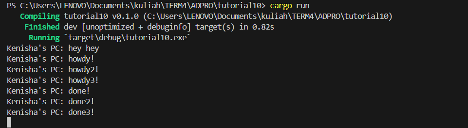

Understanding how it works

The async function runs concurrently with the main function, allowing "hey hey" to be printed first as it is executed outside the async function while the async function is still processing the future.

The drop(spawner) command closes the task channel, allowing the executor to stop running once all tasks are processed by receiving a Disconnected error from the channel. Without dropping the spawner, the channel remains open, and the executor indefinitely waits for new tasks, leading to potential program hang if no further tasks are sent. 