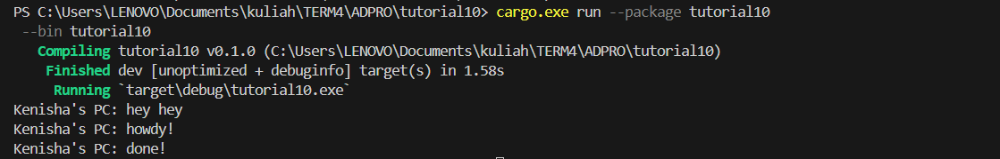

Understanding how it works

The async function runs concurrently with the main function, allowing "hey hey" to be printed first as it is executed outside the async function while the async function is still processing the future.

